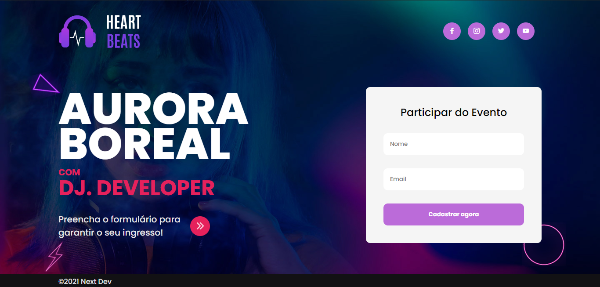

<h1 align="center">
Aurora Boreal 
| Next Dev #2|  
</h1>

<h2 align="center">

</h2>

## :rocket:**Tecnologias**
Este projeto foi desenvolvido com as seguintes tecnologias:
*  HTML
*  CSS
* Link da Página:https://aurora-boreal.vercel.app/
## :pencil:**Licença**
Este projeto está sob a licença do MIT. Consulte a the [LICENSE](https://github.com/LuisRobertoAntunes/Aurora-Boreal/blob/main/github/LICENSE) para obter mais informações.